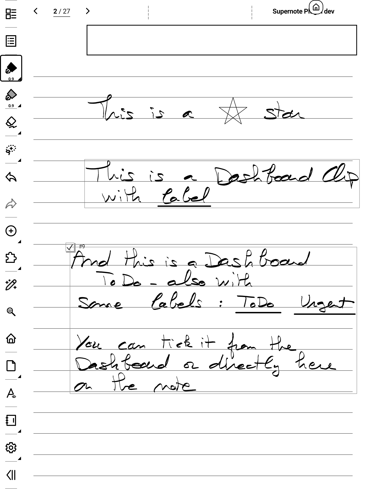
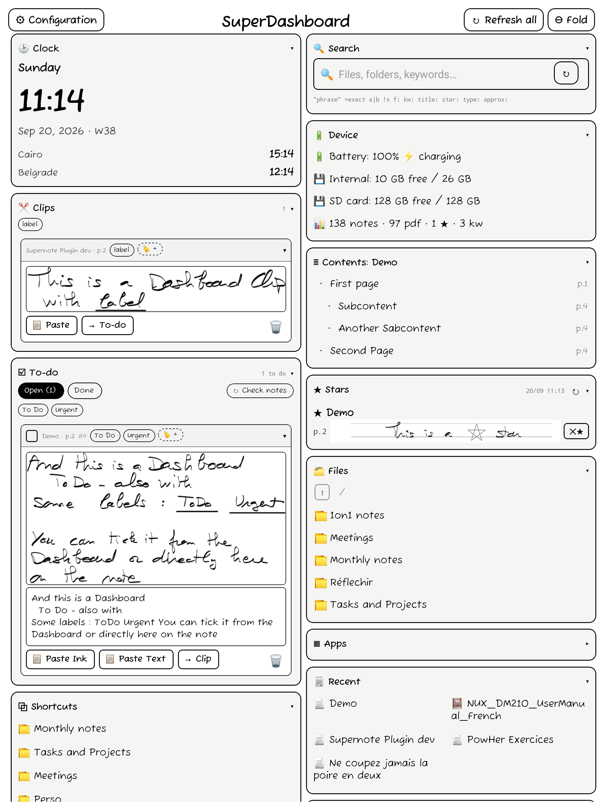
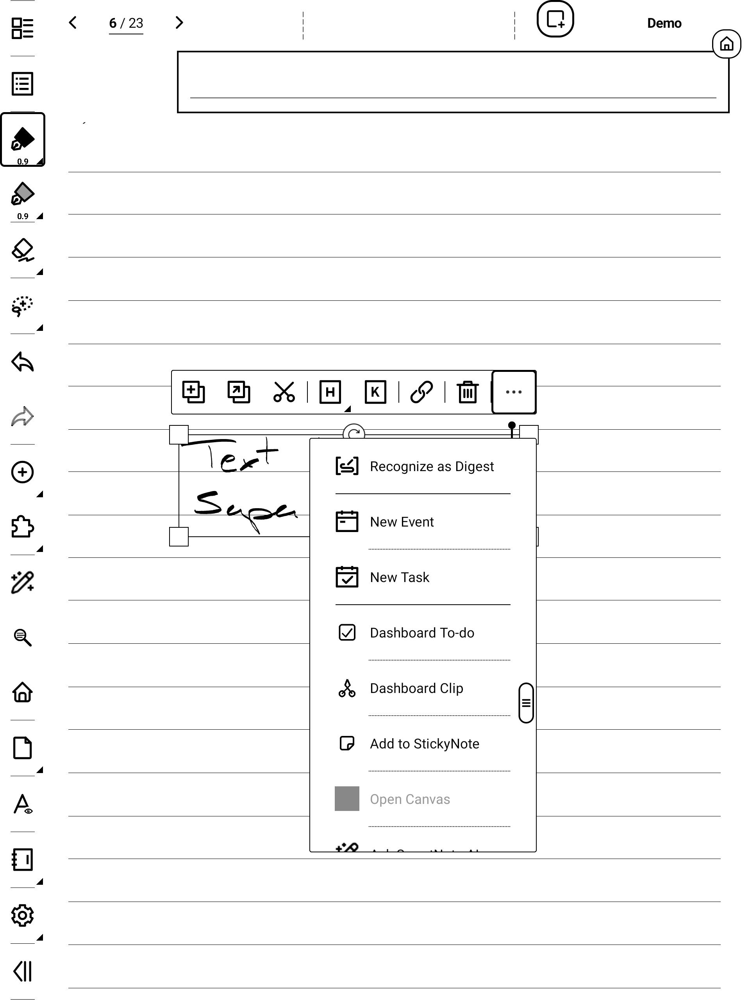
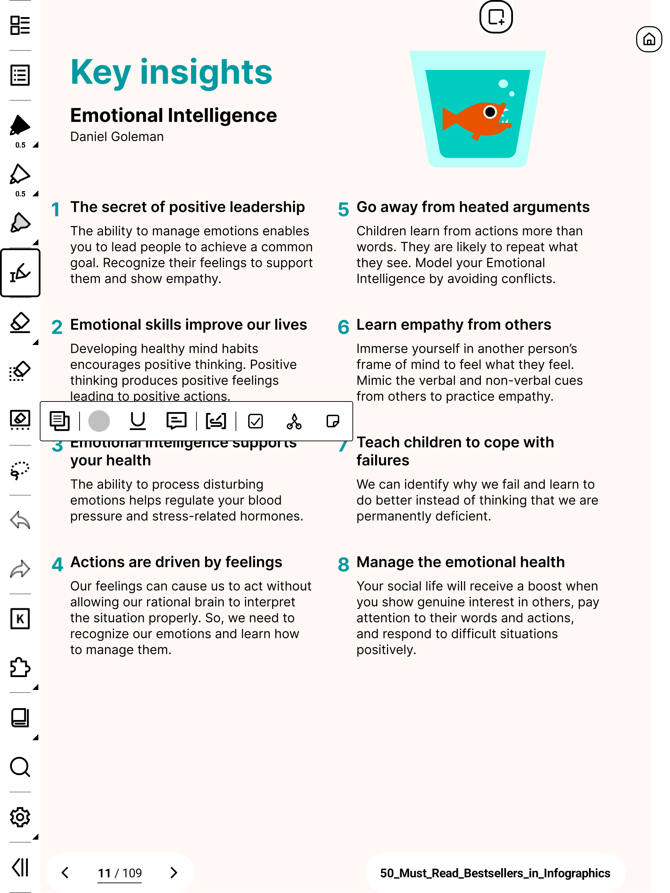
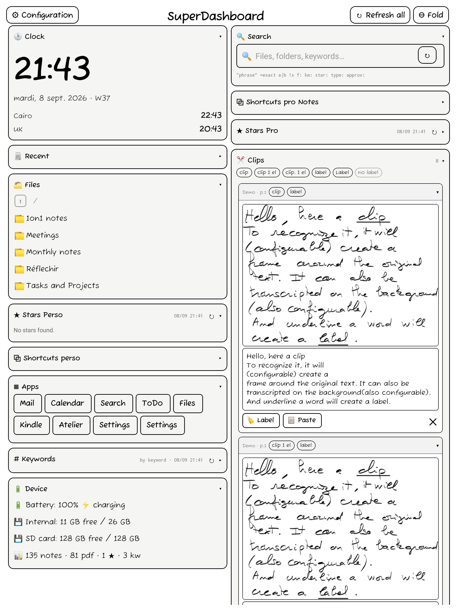
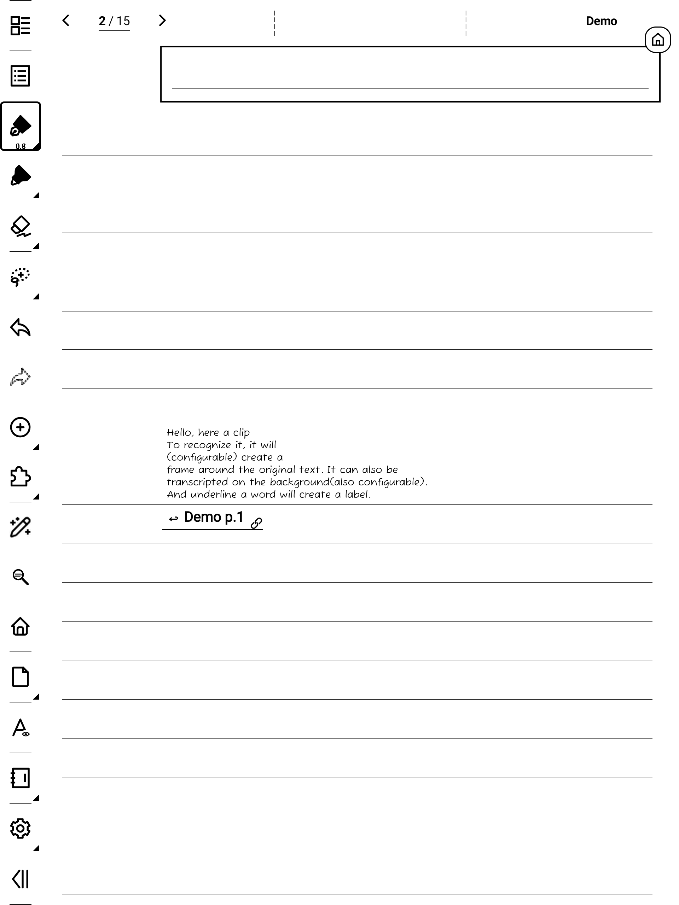
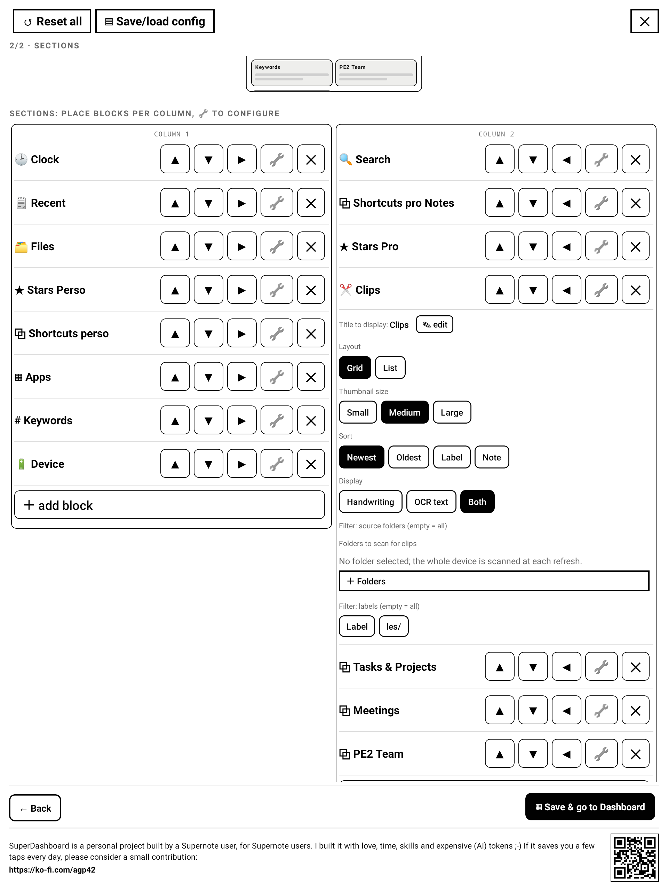

# SuperDashboard (Supernote plugin)

A configurable, always‑available dashboard for Supernote e‑ink devices. Its face is a draggable
**bubble** (the house logo) that floats over everything; tap it to open the dashboard, drag it to move it.

| A note page: a star, a clip, a to-do | The dashboard it builds |
|---|---|
|  |  |

📖 [User Guide](USER_GUIDE.md) · ⬇ [Latest release](../../releases/latest)

Capabilities validated on A5X + Manta are written up in the public repo's `docs/FINDINGS.md` and the
`supernote-plugin-dev` skill under `.claude/skills/`.

## Screenshots

| Dashboard | Clock faces | Configuration |
|---|---|---|
|  |  |  |
|  |  |  |

A 2‑column dashboard (Clock with two extra time zones + the week number, Device, Files, Clips, Search,
Stars, Apps, Recent, Keywords, Shortcuts); one dashboard showing every clock face (including the
7‑segment **Digital** one); the Look step of the settings wizard; the Stars block with handwriting
line previews; the whole UI in a MyStyle font; and a different design with sections collapsed.

## Which version do I need? (Supernote firmware)

Supernote's **Chauvet 3.29.43** (Manta / Nomad) and **2.26.40** (A5 X / A6 X), rolled out from
August 2026, add a new plugin **permission system** and other breaking plugin‑API changes. A build made
for one firmware version does not run on the other, so pick the release that matches the version on your
device (check it in the device settings):

| Your Chauvet version | Download |
|---|---|
| Older than 3.29.43 (Manta/Nomad) / 2.26.40 (A5 X / A6 X) | **v0.22.0** |
| 3.29.43 (Manta/Nomad) / 2.26.40 (A5 X / A6 X) or later | **latest release** |

Both builds are the same SuperDashboard. The Chauvet build is rebuilt for `sn-plugin-lib` 0.1.65; on
first open it asks for **file access** (READ/WRITE) to scan your notes for stars/keywords and to remove a
star; if you deny it, the launcher (shortcuts, apps, opening files/folders) still works, only the
note‑scanning zones go empty. Installing the wrong build shows *"package not compatible"* or the plugin
does nothing.

## Permissions

On the Chauvet plugin‑permission firmware SuperDashboard declares two **plugin permissions** in
`PluginConfig.json` (`uses-permissions`). They're requested once on first open and listed under
**Settings → Apps → Plugins → SuperDashboard → Permissions**:


- **`plugin.permission.FILE:READ`**: read your notes and folders. Needed to scan for **stars &
  keywords**, build the **name‑search index**, index **note headings** (Contents / title search), read
  the **Recent** list, browse folders in the **Navigation** block, **capture Note Clips and To-dos** by
  lasso, and load your **saved configuration**.
- **`plugin.permission.FILE:WRITE`**: write files. Needed to **save your configuration/profiles**, to
  **paste a clip (image + backlink) into a note**, to **mark a To-do** on a note (tick-box + "#N") and
  **draw/erase its check**, to **delete a star** from a note, and (only when you turn it on) to **draw
  the clip frame** on a note.

Why they're required: the Chauvet firmware enforces file access even on raw `java.io` reads of shared
storage; without `FILE:READ` the scans and the config read fail silently. If you **decline**, the
launcher (shortcuts, apps, opening files/folders, clock, device status) still works; only the
note‑scanning zones (Stars, Keywords, Search, Recent) and saving settings are affected.

SuperDashboard is **fully offline**: it declares **no `INTERNET`** permission and makes no network
calls. At the Android level it additionally uses the floating‑window permission (for the bubble) and
the app‑query permission (to list & launch apps for the Apps zone).

## Two surfaces

- **Bubble tap → Dashboard**: the composed result. `⊖` folds it back to the bubble; `⚙ Configuration`
  (top‑left) opens Settings.
- **Plugin toolbar button → Dashboard** too; except on first run (no config saved yet), which opens
  the Settings wizard so there's something to configure.
- **Settings** is a guided **2‑step wizard** (Look · Sections); every change autosaves. Each block is
  configured inline with a **🔧** button in the Sections step. Header has Reset all + Save/load config.

## Configuration

The **Look** step is organised into collapsible cards: **Layout & theme** (column count 1/2/3, vertical
flow masonry / fixed height, one of **9 designs** (ledger, boxed, airy, grid black, grid grey, compact,
card, minimal, underline), the bubble), **Text & font** (text & heading sizes, the **font**: System
default or any `.ttf`/`.otf` you drop into `MyStyle/fonts`, block type icons), **Note capture** (the
clip frame, backlink, handwriting / OCR text and its font & size), and **Scanning** (the scan policy).
The **Sections** step is a per‑column canvas with a live preview: **＋ add block** picks a type, ▲▼
reorder, ◀▶ move between columns, **🔧** configures a block inline, ✕ removes it.

| Look | Sections |
|---|---|
|  |  |

## The bubble


The bubble is the **house logo** in a rounded white chip (drawn natively so it stays crisp on
e‑ink): icon only, no text. It shows top‑right on first use, then stays wherever you drag it. Hidden
while the dashboard is on screen and restored on the way out; driven by the app's foreground state,
so it self‑heals on every exit path (buttons, a stray system gesture, the host backgrounding the
view) and can't get stranded. It's an overlay of the persistent plugin host, so it's re‑shown when
the plugin reloads (after a reboot / auto power‑off). It's a simple **On / Off** choice in Settings →
Look: Off uses only the toolbar button. **Removing the plugin now clears the bubble automatically**
(via the firmware's plugin‑destroy event); you no longer have to set it Off first, and a reboot
remains the ultimate fallback.

## Zones

Arranged in **1, 2 or 3 independent columns**, flowing either as **masonry** (each block takes its
natural height) or **fixed height** (each block gets a set height and scrolls inside; collapsing a
block keeps its grid slot so the ones below it don't jump up). Any titled block **collapses** to its
title (▾/▸), and the block's type icon can be shown or hidden on the title. In Settings → Sections, each
block has a small **ⓘ** with quick, precise help on its options.

- **Shortcuts**: open a folder, a note, a PDF or an EPUB in one tap (list / grid / inline).
- **Files**: a small in‑dashboard file browser: walk your folders and open a note/document without
  leaving the dashboard.
- **Search**: type to find files, folders, keywords and note **headings** across your notes (small
  query grammar, see below).
- **Contents**: the current note's **headings** as a tappable outline; tap one to jump to its page
  (see below).
- **Recent**: on the stable firmware, the device's recently‑**opened** notes & PDFs, read live from
  `/Recent/Recent.txt`. On Chauvet 3.29.43 / 2.26.40 and later that file is outside the permission
  sandbox, so Recent falls back to the recently‑**modified** notes/documents under `/Note` +
  `/Document` (newest first, cached). You choose how many to show (**4 / 8 / 12 / 16 / 20**).
- **Stars**: five‑star pages from the scan, grouped by note; optional per‑star **line preview**
  (handwriting image, or text: typewritten lines read directly, handwriting OCR'd, image fallback);
  delete a single star (`✕★`).
- **Keywords**: keyword occurrences as tappable chips; each opens its note **on the right page**.
- **Clock**: time + date + week number + extra time zones, in a choice of faces (see below).
- **Device**: battery, free storage (internal + SD card) and a stats line (notes / pdf / stars /
  keywords counts); each part is toggleable.
- **Apps**: launch device apps via exported‑activity intents.
- **Note Clips**: snippets you lassoed from notes (or PDFs / EPUBs, or selected PDF text), as labelled
  thumbnails (see below).
- **To-do**: tasks you captured from notes (or PDFs / EPUBs); a note task is marked with a tick-box you
  can check from the dashboard or by hand, a PDF / EPUB task is dashboard-only (see below).
- **Empty**: a spacer to reserve vertical space / line columns up.

The **Stars** and **Keywords** blocks show their last‑scan time and a small **↻** in the block header
(left of the collapse arrow), so a rescan is one tap without a heavy in‑card button.

Opening a file uses the firmware's `PluginFileAPI.openFile`, which jumps straight to the target page
(the old intent‑based opener ignored the page and reopened the last‑viewed one), with a fallback to
the legacy intents on older firmware.

### Note Clips

In a note, lasso anything and tap **"Dashboard Clip"** in the lasso toolbar; the snippet is captured
silently (no view opens) and pinned as a labelled thumbnail in any **Clips** block. Tapping a clip
jumps back to its **source note and page**, and **follows that page** even if you later reorder it or
move it to another note (the backlink resolves the note's stable page IDs and self-heals the pointer).
**Paste** a clip into the note you have open with **📋**: a handwriting clip is inserted as **native ink**
(its original vector strokes: move, resize and even edit it like anything you wrote; older clips paste as
an image), an OCR clip as an **editable text box**, each with a small **"↩ source"** link under it. **Underline** a word with the straight-line tool while clipping and
it becomes the clip's **label** automatically (on-device OCR, with no delay when no underline is
present); manage labels with **🏷**.

Optionally **OCR** clips to text: turn on **OCR text** in Look : Note clips (the recognition runs in the
background right after capture, so it never slows you down), then each Clips block chooses how to show
its clips: **handwriting**, **OCR text**, or **both** (text falls back to the image when OCR finds
nothing). An OCR'd clip pastes as an editable text box; its **font** (your MyStyle fonts) and **size**
are configurable.

Each clip is a **card** (a header with its source note / page + labels, tap to collapse; tap the content
to open the source). A Clips block can **filter** by source folder and/or label, **sort** Newest /
Oldest / Label / Note (**by Note** groups clips under a per-note header), switch grid or list, and set
thumbnail **size** S / M / L (clips fill the full width in 2 or 3 column dashboards); a clip is never
scaled larger than the original extract. The block header also has a live **label filter**: tap the
label chips (they combine with **OR**), plus a grey **no label** chip. Optionally a thin **frame**
(off / grey / black, set in Look) is drawn on the note around what you captured, as a permanent mark
(removing the clip does not erase it). You can also clip from **PDFs / EPUBs**: lasso your annotations,
or select printed text from the document's selection toolbar. PDF / EPUB captures are dashboard-only
(nothing is drawn on the document; the **↩ source** backlink still returns you to the page). Up to 200
clips.












### To-dos

A to-do is a clip you capture as a **task**. In a note, lasso it and tap the second lasso button,
**"Dashboard To-do"**: the area gets a frame plus a small **tick-box** in its top-left corner and a
**"#N"** tag, and the task appears in any **To-do** block. The tick-box and "#N" are how the plugin
re-finds the task on the page later, so they're always drawn (independent of the Clips frame setting).

Checking works **both ways**:

- **Tick in the dashboard** → the plugin draws the check inside the box on the note; untick and it
  erases it.
- **Tick by hand on the note** → tap **"↻ Check notes"** on the To-do block (or **↻ Refresh all**) and
  the dashboard picks it up. It replaces your hand-drawn check with its own tick (so a later dashboard
  untick can clear it). Un-checking is done from the dashboard; the hand-check pull is manual so opening
  the dashboard stays fast. This runs for the note you have open.

If a marked area gets lasso-cut to another page or note, the dashboard offers an **on-demand search**
(this note, then all notes, newest first, with a Stop) to find its "#N" and sync it. The To-do block
has **Open / Done** tabs, groups by note, filters by label, and a **🗑 Clear done**; finished tasks are
kept (never auto-deleted) and are immune to the 200-clip cap. Deleting a to-do removes only its "#N"
tag from the note (fast, expected page only), leaving the frame so the page still shows it was a task.

You can also make a to-do from a **PDF / EPUB** (lasso an annotation, or select printed text, then tap
**"Dashboard To-do"**). A PDF / EPUB to-do is **dashboard-only**: nothing is drawn on the document and
there's no live sync (the on-page tick-box + "#N" handle is a notes-only feature), so tick it in the
dashboard; the **↩ source** backlink returns you to the page.

### Contents

The **Contents** block lists the **current note's headings** (Supernote "Title" elements) as a tappable
outline; tap a heading to jump to its page. Titles carry no text, so each is **OCR'd** the first time
and **cached per page**: a note you haven't changed paints instantly, and only the pages you edit are
re-read. Converted (typewritten) titles are read directly, and legacy headings from older notes are
included. The block header shows the note's name; you can map each of the four title styles to an
indent level. The same on-device index also powers **note-title search** (the `title:` filter), which a
Search block enables per block; it refreshes notes you've changed when you open the dashboard.

### Clock

Faces: **Large**, **Compact**, **Weekday**, **Jumbo**, **Digital** (a real 7‑segment display, bundled
so it works offline) and **Stamp**. 12 or 24 hour; the **date** is optional; an optional **week
number** in either **ISO** (Monday‑start, the European standard) or **US** (Sunday‑start) convention;
and any number of **extra time zones**, each a label plus a +/- hour offset from your device's local
time (a ½ control adds the 30‑minute zones). A regional format sets the date order and month/day names.


### Search

Searches file & folder names plus keywords (and, when enabled, note **headings**) from your scanned
notes, grouped into Notes / PDFs / other docs / Folders / Keywords / Titles. Grammar: `"phrase"`
(literal), `=exact`, `a|b` (either), `!word` (exclude), `f:folder`, `kw:` (keywords only), `title:`
(headings only, when title search is on), `star:` (starred files only), `type:note|pdf|doc|folder`, and
`approx:` (typo‑tolerant). Turn on **"Also search note titles"** in a Search block to include headings
(first indexing runs from there; afterwards notes you change are re-indexed when you open the dashboard).
A block can be scoped to specific folders.


## Scanning

Stars/Keywords come from scanning the chosen folders. The scan is **incremental** (a persisted
per‑file cache keyed by path+mtime; only edited notes are re‑scanned), so the first scan of a folder
set is slow and later ones are near‑instant. Zones over the same folders share one scan.

A **manual ↻ Refresh** additionally flushes the note currently open underneath (`saveCurrentNote`) so
stars/keywords you just added on the current page are caught without turning the page. Auto‑scan on
open never flushes.

## Storage

- **Config**: JSON at `MyStyle/Plugins/Dashboard/config.json`, written by the wizard (native atomic
  write, read via the native reader; `fetch` caches `file://`). Named profiles in `profiles.json`.
  Hand‑editable; `normalize`/`normalizeZone` guard against malformed input. (The on‑disk folder keeps
  its historical `Dashboard` name so existing settings survive the rename to SuperDashboard.)
- **Caches**: the scan cache (`scancache.json`) and star line‑preview PNGs (`line_*.png`) live in
  the **plugin‑private dir** (`getPluginDirPath()`), not `MyStyle` (which is cloud‑synced and
  file‑observed; caches don't belong there). Orphaned line PNGs are garbage‑collected after every
  Stars scan (a deleted star / removed note / preview turned off no longer leaks its PNG). Migrated
  once from the old `MyStyle` location, which is then purged.

## Build & deploy

```bash
source ../env.sh                                       # JDK 21 + Android SDK on PATH
./buildPlugin.sh                                       # → build/outputs/SuperDashboard.snplg
gio copy build/outputs/SuperDashboard.snplg 'mtp://<device>/Supernote/MyStyle/SuperDashboard.snplg'
# install on device: Settings → Apps → Plugins → Choose Installation Package (pick the .snplg)
```

## Known limitations

- On Chauvet 3.29.43 / 2.26.40 and later, `/Recent/Recent.txt` is outside the FILE:READ sandbox, so the
  Recent zone shows recently‑**modified** files (under `/Note` + `/Document`) instead of recently‑opened ones.
- Stars/keywords inside PDFs aren't returned by the SDK (notes only).
- New stars/keywords on the page being edited are caught by a **manual ↻ Refresh** (which flushes the
  open note); an auto‑scan alone sees them only after a page‑turn (when the editor saves).

## Support

SuperDashboard is a personal project built by a Supernote user, for Supernote users. If it saves you a
few taps every day, a small contribution is appreciated: https://ko-fi.com/agp42
