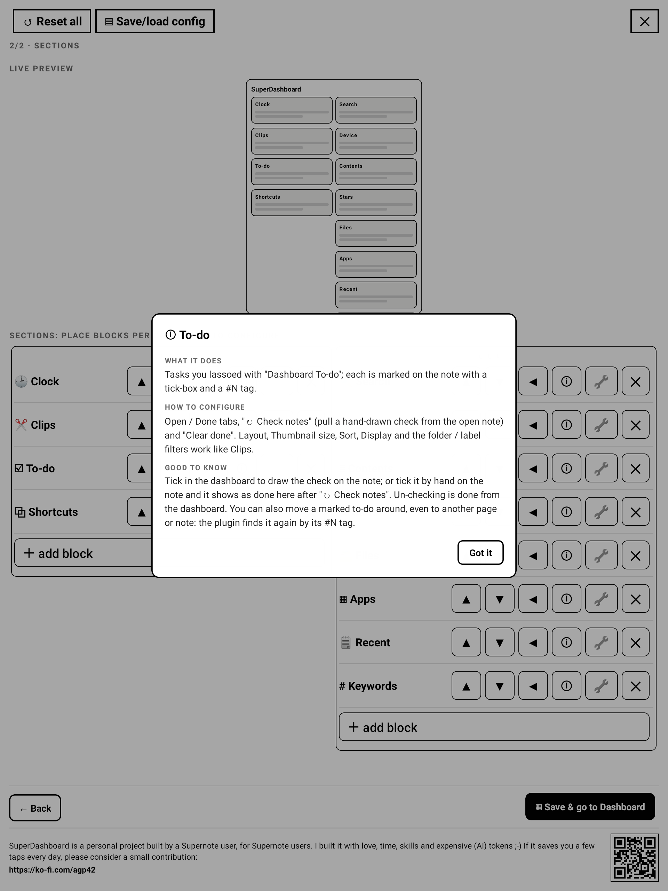

# SuperDashboard for Supernote: User Guide

## 1. Overview

SuperDashboard adds a floating **house bubble** (and a toolbar button) to your Supernote. One tap opens
a **dashboard you compose yourself** from **modules**: shortcuts, a file browser, search (names,
keywords and note headings), a Contents outline of the note you're in, recent files, stars, keywords, a
clock, device status, app launchers, Note Clips and To-dos. Lay them out in 1, 2 or 3 columns, in the
design and font you like. It runs **fully on-device and offline**: no account, no network.

### Which version do I need?

Supernote's firmware is called **Chauvet** (the platform name, like "Android"), so what matters is the
**version number**. This build is for **Chauvet 3.29.43** (Manta / Nomad) / **2.26.40** (A5 X / A6 X)
**or later**, which added the plugin permission system. On **older** Chauvet, use **v0.22.0** instead: a
build made for one firmware won't run on the other ("package not compatible", or it does nothing). Check
your version in the device settings.

### Install

1. Copy `SuperDashboard-v<version>.snplg` (from the GitHub Releases, or `dist/`) into the **`MyStyle`**
   folder on your Supernote (USB, or the Partner app).
2. On the device: **Settings → Apps → Plugins → Choose Installation Package**, and pick the `.snplg` you
   copied. (**Go to InkHub** is Supernote's plugin store; for a GitHub build, use *Choose Installation
   Package*.)

| Plugins page | About this plugin |
|---|---|
|  |  |

Open any note or document and tap the **SuperDashboard** button in the side toolbar. On first run it
opens the Settings wizard (nothing is configured yet); afterwards it opens your dashboard.

### Permissions

On first run SuperDashboard asks once for **file access** (listed under Settings → Apps → Plugins →
SuperDashboard → Permissions):

- **FILE:READ** to read your notes & folders: scan **stars/keywords**, build the **search** index, index
  **note headings** (Contents / title search), read **Recent**, browse in the **file browser**, and
  capture **Note Clips and To-dos**.
- **FILE:WRITE** to **save your settings**, **paste a clip** into a note, **mark a To-do** (tick-box +
  "#N") and **draw/erase its check**, **delete a star**, and (only when you turn it on) draw the clip
  frame.

Without READ the note-scanning modules stay empty; the launcher (shortcuts, apps, opening files, clock,
device) still works. SuperDashboard declares **no INTERNET permission**.

---

## 2. The dashboard and the two ways in

There are two ways to open the dashboard:

- **The house bubble**: a small floating chip with the house logo that hovers over everything (notes,
  folders, apps, settings). **Tap** it to open the dashboard; **drag** it to move it (it stays where you
  leave it). It hides while the dashboard is open and returns on any exit, so it never gets stranded
  off-screen; after a restart it reappears when the plugin next loads. Set it **On / Off** in Settings →
  Look. Removing the plugin clears it automatically.
- **The toolbar button** (**SuperDashboard**, in a note/document side toolbar). Set the bubble **Off**
  to rely on the toolbar button alone.

**On the dashboard**, the header has **⚙ Configuration** (top-left), **↻ Refresh all** and **⊖ Fold**
(back to the bubble) top-right. Blocks are arranged in **1, 2 or 3 columns**; any titled block
**collapses** to its title with the ▾ / ▸ on its header.

---

## 3. Configuration (Settings)

Open Settings from **⚙ Configuration** (or the toolbar button on first run). It's a **2-step wizard**
(Look, Sections); **every change saves automatically**. The header always has **↺ Reset all**,
**▤ Save/load config**, and a **✕** to close.

### 3.1 Look

The Look step is grouped into **collapsible cards** (tap a card's header to fold/unfold it).

| Layout & theme | Text & font · Note capture · Scanning |
|---|---|
|  |  |

- **Layout & theme**: **1 / 2 / 3** columns (each an independent vertical stack); **vertical flow**
  (Masonry = natural height, or Fixed height = a set height that scrolls inside); one of **9 designs**
  (Ledger, Boxed, Airy, Grid black, Grid grey, Compact, Card, Minimal, Underline), previewed on your own
  layout; and the **bubble** On / Off.
- **Text & font**: **text size** and an independent **heading size** (S / M / L / XL); the **font**
  (System default, or any `.ttf` / `.otf` you drop into `MyStyle/fonts`); **block icons** show/hide.
- **Note capture**: defaults for Clips & To-dos (the on-note **frame**, the **↩ source** link, and
  **Handwriting / OCR text** with its pasted-text size & font). See the Note Clips and To-do modules.
- **Scanning**: how often Stars/Keywords rescan (On open / Stale > 6h / Stale > 24h / Manual).

### 3.2 Sections

Place blocks per column. **＋ add block** offers every module type; **▲▼** reorder, **◀▶** move between
columns, **🔧** configures a block inline, **✕** removes it, **✎** edits its displayed title (leave it
blank to hide it). A live preview sits on top.

| Columns & controls | The add-block menu |
|---|---|
|  |  |

Each block also has a **ⓘ** button with quick, precise help on its options (What it does · How to
configure · Good to know) right on the device:

### 3.3 Save / load configurations

The header's **▤ Save/load config** saves your whole dashboard under a name and reloads it anytime;
handy before experimenting, or to recover after an accidental **↺ Reset all**. Profiles live in
`MyStyle/Plugins/Dashboard/profiles.json`.

---

## 4. The modules

Each module is a block you add in **Sections**. Add any number of them across your columns. Below: what
each one does and how to configure it.

### 🔗 Shortcuts

**What it does:** one-tap openers for the folders, notes, PDFs and EPUBs you use most; each opens on its
saved page.
**How to configure:** add with the **＋** (a browser: tick several items, then Save). Reorder with ▲▼,
remove with ✕. Layout: List, Grid (tiles) or Inline (wrapping chips).

### 📁 Files

**What it does:** a file browser inside the dashboard: walk your folders and open any note or document
without leaving it.
**How to configure:** set the **Root folder** (✎ set) where the browser starts (default `/Note`).

### 🔍 Search

**What it does:** finds file & folder names, keywords, and (optionally) note headings; tap a result to
open it on its page.
**How to configure:** turn on **"Also search note titles"** to include headings, then tap **"≣ Index
titles now"** once. Scope: add folders to limit the search, or leave empty for the whole device.
**Good to know:** grammar under the box, e.g. `"phrase"`, `=exact`, `a|b`, `!exclude`, `f:folder`,
`kw:`, `title:`, `star:`, `type:note|pdf|doc|folder`, `approx:`. The title index is incremental, so
re-running it after adding notes is fast.

| Title results | Enabling title search |
|---|---|
|  |  |

### ≣ Contents

**What it does:** an outline of the headings in the note open behind the dashboard; tap one to jump to
its page.
**How to configure:** **"Indent by title level"** Off = flat list; On indents each heading by its
Supernote title style, mapping Style 1 (black), 2 (gray/white), 3 (gray/black), 4 (shadow) to levels
1-4.
**Good to know:** headings are OCR'd once per note and cached, so unchanged notes are instant. Converted
(typewritten) and older-note headings are included.

| The outline (indented) | Indent mapping |
|---|---|
|  |  |

### 🗒 Recent

**What it does:** your recently-modified notes and documents, newest first.
**How to configure:** count **4 / 8 / 12 / 16 / 20**; Layout List / Grid / Inline.
**Good to know:** on Chauvet 3.29.43 / 2.26.40+ this shows recently-*modified* files (the recently-opened
list is outside the plugin's sandbox there).

### ★ Stars

**What it does:** every starred (★) page from the last scan, grouped by note.
**How to configure:** folders to scan (empty = whole device); Note order By date / By name; Line preview
Off / Image / Text (OCR); "Allow deleting a star" adds a **✕★** to remove a star from the note.
**Good to know:** Image/Text previews make the scan slower; scanning is incremental. Rescan with the
**↻** in the block header.

### # Keywords

**What it does:** your notes' keywords as tappable chips; each opens its note on the right page.
**How to configure:** folders to scan (empty = whole device); Note order By date / By name; Group by
Keyword / Note; View List / Inline / By folder; **＋ Keyword** limits the block to chosen ones, "Show
all" clears the filter.

### 🕑 Clock

**What it does:** time, date, week number and extra time zones, in a choice of faces.
**How to configure:** Style (Large / Compact / Weekday / Jumbo / Digital 7-segment / Stamp); 24- or
12-hour; Date Show/Hide; Week number Off / ISO (Mon) / US (Sun); Region format (date order & names);
**＋ add time zone** (label + offset with - / +, ½ adds 30 min; up to 6). A live preview is shown.

### 🔋 Device

**What it does:** battery, free storage and a library stats line.
**How to configure:** toggle each line: Battery, Free storage (internal + SD card), Stats (counts of
notes, PDFs, stars, keywords).

### ▦ Apps

**What it does:** buttons that launch device apps (ToDo, Calendar, Files, or any installed app).
**How to configure:** add with **＋ Apps** (tick from Supernote apps or "Show all apps", then Save).
Reorder ▲▼, remove ✕. Layout Inline / Grid / List.

### ✂ Note Clips

**What it does:** snippets you lassoed from notes, as labelled thumbnails; tap one to jump to its source
page, or paste it back into a note.
**How to capture:** in a note, lasso something and tap **"Dashboard Clip"** in the lasso toolbar; it's
captured silently. **Underline a word** with the straight-line tool while clipping and it becomes the
clip's **label** automatically.
**How to configure:** Layout Grid / List; Thumbnail size S / M / L; Sort Newest / Oldest / Label / Note
(Note groups clips under a per-note header); Display Handwriting / OCR text / Both; filter by source
folders and/or labels.
**Good to know:** Display OCR/Both needs **"OCR text"** on in Look : Note capture. **📋 Paste Ink** drops
a handwriting clip back as **editable strokes** (move, resize, even rewrite it); an OCR clip pastes as an
editable text box. Each gets a **↩ source** link back to where it came from, which follows the page even
if you reorder it or move it to another note.

| The clip marked on the note | An OCR clip pasted back |
|---|---|
|  |  |

### ☑ To-do

**What it does:** tasks you lassoed from notes; each is marked on the note with a **tick-box** and a
**"#N"** tag.
**How to capture:** in a note, lasso a task and tap **"Dashboard To-do"** (the second lasso button).
**How to configure:** Open / Done tabs, **"↻ Check notes"** (pull a hand-drawn check from the open
note) and **"🗑 Clear done"**. Layout, Thumbnail size, Sort, Display and the folder / label filters work
like Clips.
**Good to know:** tick it in the dashboard to draw the check on the note; or tick it **by hand** on the
note and it shows as done here after **↻ Check notes** (un-checking is done from the dashboard). You can
**move** a marked to-do anywhere, even to another page or note: the plugin finds it again by its **#N**.
Finished tasks are kept (never auto-deleted) and don't count against the 200-clip cap; deleting one
removes only its "#N" from the note.

| Open | Done (struck through) |
|---|---|
|  |  |

| The to-do marked on the note | The box checked from the dashboard |
|---|---|
|  |  |

### ▭ Empty

A spacer to reserve vertical space or line up columns.

---

## 5. Reference

### Search grammar

| Type | Means |
|---|---|
| `two words` | all words must match (in any order) |
| `"exact phrase"` | a literal phrase, spaces included |
| `=name` | the whole name equals this |
| `a\|b` | either `a` or `b` |
| `!word` | exclude anything matching `word` |
| `f:folder` | only items whose path contains `folder` |
| `kw:` | only keyword results |
| `title:` | only note headings (when title search is on) |
| `star:` | only files that have a five-star |
| `type:note` `type:pdf` `type:doc` `type:folder` | keep only that kind |
| `approx:` | typo-tolerant (subsequence) match |

### Scanning (stars & keywords)

Stars and Keywords come from scanning your notes. Each block shows its **last scan** time and a **↻** in
its header; **↻ Refresh all** refreshes everything. The scan is **incremental**: the first scan of a
folder set is slow, later ones only re-read files you've **edited**; blocks over the **same folders**
share one scan. A **manual ↻ Refresh** also saves the note open underneath, so a star/keyword you *just*
added on the current page shows up without turning the page. Tip: point scans at `/Note` (or a subfolder)
rather than the whole device for speed.

### Multi-select browser

**＋ Add folder / note / PDF / EPUB** (Shortcuts), the **scan folders** picker (Stars / Keywords /
Search / Clips / To-do) and the **apps** picker all use a full-page browser: navigate, tick several
items, then **Save (N)** adds them at once.

### Advanced

The whole configuration is a JSON file at **`MyStyle/Plugins/Dashboard/config.json`**; power users can
edit it directly (the wizard writes the same file). Scan caches, the title (Contents) cache, star
line-preview images and clip thumbnails live in the plugin's private folder, so they aren't cloud-synced
and are cleaned up automatically.

### Good to know / limits

- **Page jump**: notes, PDFs and EPUBs open **on the target page** (a star's, keyword's, shortcut's,
  clip's or heading's page) via the firmware's file opener.
- **Recent on Chauvet 3.29.43 / 2.26.40+**: shows recently-*modified* notes/documents (the recently-opened
  list is outside the plugin's sandbox there).
- **Stars/keywords in PDFs/EPUBs** aren't listed (the system only exposes them for notes).
- **Note Clips / To-dos** capture works in **notes only** (no PDF lasso).
- **To-dos**: checking is two-way, but **un-checking is done from the dashboard** (a hand-drawn check is
  picked up on **↻ Check notes** / **Refresh all**, for the note you have open, and replaced with the
  plugin's own tick so it can be cleared).
- **Contents / title search** are OCR-based and cached: a heading appears once its page has been read;
  handwriting OCR can occasionally misread one.
- **New stars/keywords** on the page you're editing show up on a **manual ↻ Refresh**; an auto-scan alone
  sees them after a page-turn (when the editor saves).

---

## 6. Support

SuperDashboard is a personal project built by a Supernote user, for Supernote users. If it saves you a
few taps every day, a small contribution is appreciated: https://ko-fi.com/agp42
