# SuperDashboard for Supernote: User Guide

SuperDashboard turns a floating **⊕ bubble** (and the plugin toolbar button) into a launcher for your
Supernote: one tap opens a dashboard you compose yourself from **modules** (blocks): shortcuts, a file
browser, name & title search, a Contents outline, recent files, stars, keywords, a clock, device
status, app launchers, Note Clips and To-dos. It runs fully on-device and offline.

## See it in action

*Bubble to dashboard, opening shortcuts, adding a ★ and refreshing to catch it, keyword chips, the
settings wizard, and folding back to the bubble.* ▶ [Full-quality walkthrough (MP4)](docs/dashboard-demo.mp4)

> **Which version do I need?** Supernote's firmware is called **Chauvet** (the platform name, like
> "Android"), so what matters is the **version number**. This build is for **Chauvet 3.29.43**
> (Manta / Nomad) / **2.26.40** (A5 X / A6 X) **or later**, which added the plugin permission system.
> If your device is on an **older** Chauvet, use **v0.22.0** instead: a build made for one firmware
> version won't run on the other ("package not compatible", or it does nothing). Check your version in
> the device settings.

---

## 1. Install

1. Copy `SuperDashboard.snplg` (from the GitHub Releases, or `dist/`) into the **`MyStyle`** folder on
   your Supernote (USB, or the Partner app).
2. On the device: **Settings → Apps → Plugins**, then tap **Choose Installation Package** and pick the
   `SuperDashboard.snplg` you copied. (**Go to InkHub** is Supernote's plugin store; for a build from
   GitHub, use **Choose Installation Package**.)

| Plugins page | About this plugin |
|---|---|
|  |  |

Open any note or document and tap the **SuperDashboard** button in the side toolbar. On first run it
opens the Settings wizard (nothing is configured yet); afterwards it opens your dashboard directly. The
floating bubble also opens the dashboard from anywhere.

**First-run permissions (Chauvet 3.29.43 / 2.26.40+).** SuperDashboard asks once for **file access**;
the two permissions are listed under Settings → Apps → Plugins → SuperDashboard → Permissions:

- **FILE:READ**: read your notes & folders: scan **stars/keywords**, build the **search** index, index
  **note headings** (Contents / title search), read **Recent**, browse in the **file browser**, capture
  **Note Clips and To-dos**, and load your **saved settings**.
- **FILE:WRITE**: **save your settings/profiles**, **paste a clip** into a note, **mark a To-do**
  (tick-box + "#N") and **draw/erase its check**, **delete a star** from a note, and (only when you turn
  it on) draw the optional **clip frame**.

Without READ the scans fail silently. If you decline, the launcher (shortcuts, apps, opening
files/folders, clock, device status) keeps working; only the note-scanning modules and saving settings
are affected. SuperDashboard is fully offline: **no INTERNET permission**, no network calls.

---

## 2. The bubble and the toolbar button

There are two ways in:

- The **bubble**: the dashboard's **⊖** button folds it into a small floating **⊕ house bubble** that
  hovers over everything (notes, folders, apps, settings). **Tap** it to open the dashboard; **drag** it
  anywhere and it stays. It hides while the dashboard is open and returns on any exit, so it never gets
  stuck off-screen; after a restart it reappears when the plugin next loads. In Settings → *Look* it's a
  simple **On / Off** choice. Removing the plugin clears the bubble automatically.
- The **toolbar button** (**SuperDashboard**, in a note/document side toolbar) opens the dashboard too.
  Set the bubble **Off** to rely on the toolbar button alone.

---

## 3. Building your dashboard (Settings)

Open Settings from **⚙ Configuration** on the dashboard (or the toolbar button on first run). It's a
**2-step wizard** (Look, Sections); every change **saves automatically**. The header always shows
**↺ Reset all**, **▤ Save/load config** (see section 5), and a **✕** to close.

### Look

The Look step is grouped into **collapsible cards** (tap a card's header to fold/unfold it).

| Layout & theme | Text & font · Note capture · Scanning |
|---|---|
|  |  |

- **Layout & theme**: **1 / 2 / 3** columns (each an independent vertical stack); **vertical flow**
  (Masonry = natural height, or Fixed height = a set height that scrolls inside); one of **9 designs**
  (Ledger, Boxed, Airy, Grid black, Grid grey, Compact, Card, Minimal, Underline), previewed on your own
  layout; and the **bubble** On / Off.
- **Text & font**: **text size** and an independent **heading size** (S / M / L / XL); the **font**
  (System default, or any `.ttf` / `.otf` you drop into `MyStyle/fonts`); and **block icons** show/hide.
- **Note capture**: defaults for Clips & To-dos (the on-note **frame**, the **↩ source** link, and
  **Handwriting / OCR text** with its pasted-text size & font). See the Note Clips and To-do modules.
- **Scanning**: how often Stars/Keywords rescan (On open / Stale > 6h / Stale > 24h / Manual).

### Sections

Place blocks per column. **＋ add block** offers every module type (including **Contents** and
**To-do**); **▲▼** reorder, **◀▶** move between columns, **🔧** configures a block inline, **✕** removes
it, **✎** edits its displayed title (leave blank to hide it). A live preview sits on top.

| Columns & controls | The add-block menu |
|---|---|
|  | 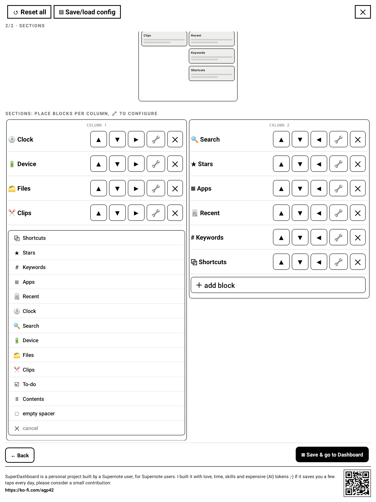 |

---

## 4. The modules

Each module is a block you add in **Sections**. Arrange any number of them across your columns; any
titled block **collapses** to its title (▾ / ▸). In Settings → Sections, each block has a small **ⓘ**
with quick, precise help on its options (this guide is the longer version). Here's what each one does.

### 🔗 Shortcuts

One-tap openers for the folders, notes, PDFs, EPUBs and comics (CBZ/XPS/FB2) you use most; each opens
**on the right page**. Add them with the multi-select browser (section 6); show them as a list, a grid,
or inline.

### 📁 Files

A small **file browser** inside the dashboard: walk your folders and open any note or document without
leaving the dashboard.

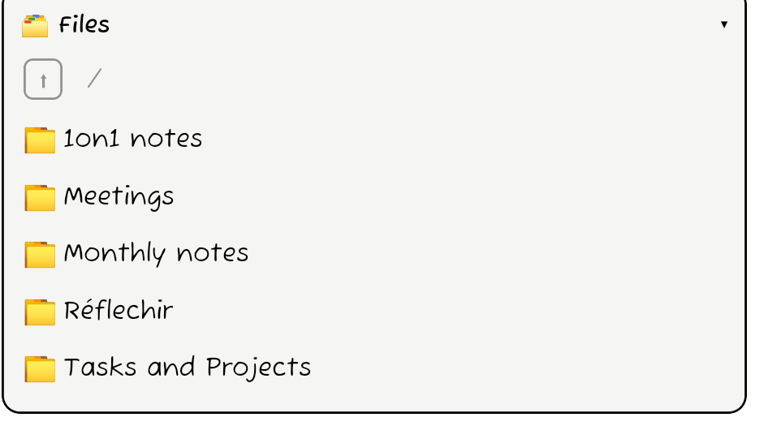

### 🔍 Search

Type to find **file & folder names**, **keywords**, and (when enabled) **note headings**, grouped into
Notes / PDFs / other docs / Folders / Keywords / Titles. Tap a result to open it (a keyword or heading
lands on its exact page). See the grammar in section 6.

Turn on **"Also search note titles"** in the block's **🔧** to include headings. Titles need a one-time
**OCR index** (built with **Index titles now**); it's incremental, so later runs only re-read pages you
changed, and notes you edit are refreshed when you next open the dashboard.

| Title results (`title:` / free text) | Enabling title search (🔧) |
|---|---|
| 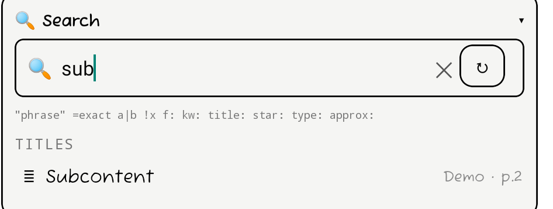 | 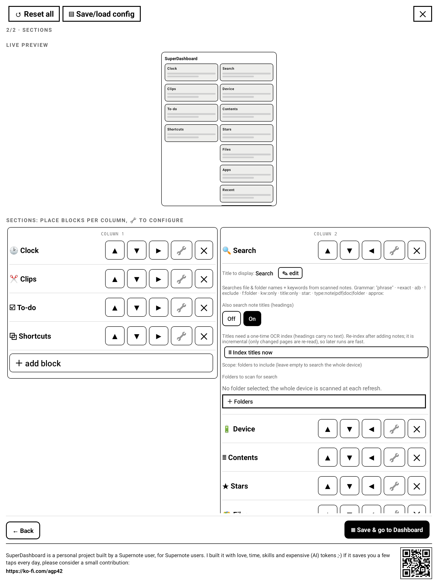 |

### ≣ Contents

An outline of the **current note's headings** (the note open behind the dashboard); tap a heading to
jump to its page. The header shows the note's name. Titles carry no text on the device, so each is
**OCR'd once and cached per page**: an unchanged note appears instantly, only edited pages are re-read.
Converted (typewritten) titles are read directly, and headings from older notes are included. In **🔧**
you can map each of the four Supernote title styles to an **indent level**. The same index powers
note-title search (above).

| The outline (indented) | Indent mapping (🔧) |
|---|---|
| 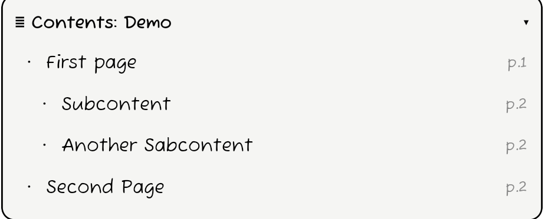 | 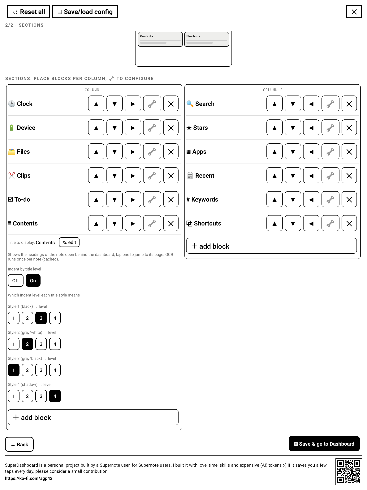 |

### 🗒 Recent

Your recently-used notes & documents. On Chauvet 3.29.43 / 2.26.40+ the device's recently-**opened**
list is outside the plugin sandbox, so Recent shows the recently-**modified** notes/documents under
`/Note` and `/Document`, newest first. Choose how many to show (**4 / 8 / 12 / 16 / 20**) in **🔧**.

### ★ Stars

Every starred (★) page from the last scan, grouped by note. A per-star **line preview** is optional
(handwriting image, or text: typewritten lines read directly, handwriting OCR'd, image fallback). Tap to
open the page; **✕★** deletes a single star from the note.

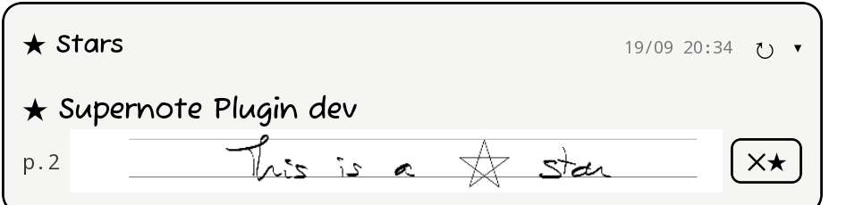

### # Keywords

Your notes' keywords as tappable **chips**, grouped by keyword; each chip opens that exact note **on its
page**.

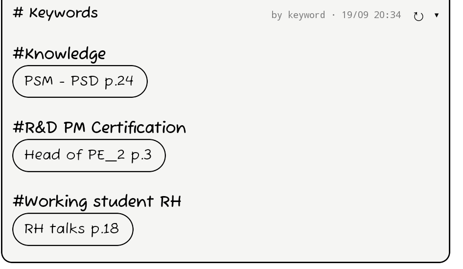

### 🕑 Clock

Time, date, week number and extra time zones. Faces: **Large, Compact, Weekday, Jumbo, Digital** (a real
7-segment display, bundled so it works offline) and **Stamp**. 12 / 24-hour; optional **date**; optional
**week number** in **ISO** (Mon) or **US** (Sun); a **region format** for date order & names; and any
number of **extra time zones**, each a label plus a +/- hour offset from local time (the ½ control adds
30-minute zones).

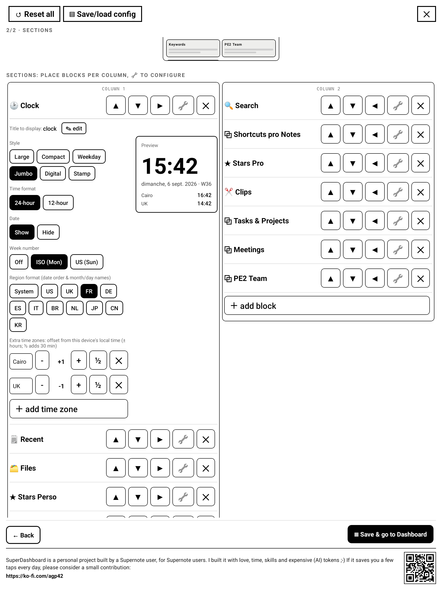

### 🔋 Device

Battery, free storage (internal + SD card) and a library stats line (notes / PDFs / stars / keywords).
Each part can be toggled in **🔧**.

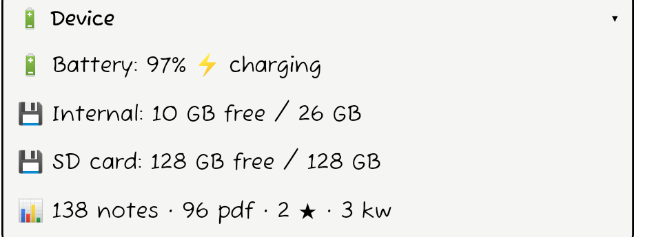

### ▦ Apps

Buttons that launch device apps (ToDo, Calendar, Document, Files, or any installed app) via their
exported activities. Pick them with the multi-select picker (section 6).

### ✂ Note Clips

Pin a snippet of a note onto the dashboard. In a **note**, lasso a region and tap **"Dashboard Clip"**
in the lasso toolbar: it's captured **silently** (no view opens) and appears as a thumbnail in a **Clips**
block. **Tap the content** to jump back to its source page (the backlink **follows the page** even if you
reorder it or move it to another note).

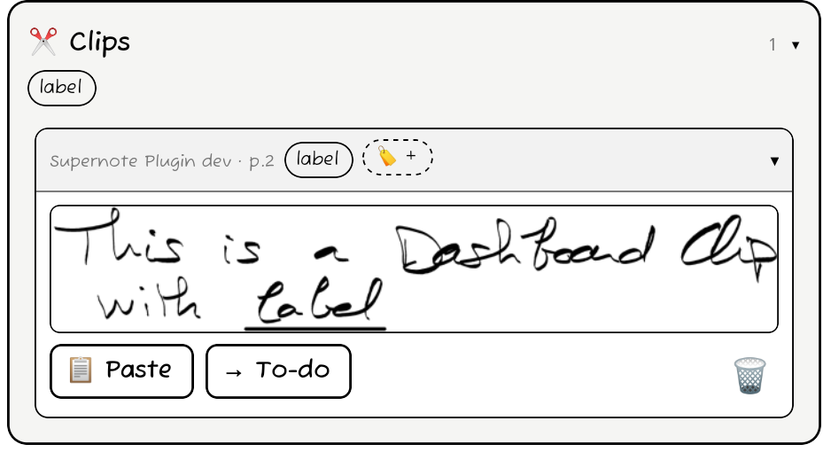

- **Auto-label by underlining**: lasso a snippet with a word **underlined with the straight-line tool**
  and that word becomes the clip's **label** automatically (on-device, no delay when there's no
  underline). Manage labels with **🏷**; filter the block by label chips (they combine with OR) or by
  source folder; sort Newest / Oldest / Label / Note (by **Note** groups under a per-note header); set
  thumbnail size S / M / L.
- **OCR to text (optional)**: turn on **OCR text** in Look → Note capture. Recognition runs in the
  **background** after capture; each block then shows **Handwriting / OCR text / Both**. A pasted OCR
  clip becomes an **editable text box** in your chosen font & size.
- **Paste back into a note** with **📋 Paste** (a handwriting clip as **native ink**: editable strokes
  you can move, resize and rewrite, with no shrink-on-move; older clips paste as an image. An OCR clip
  pastes as a text box). Each gets a small **↩ source** link under it. Move / resize by lassoing it.
- **On-note frame (optional)**: a grey or black rectangle drawn around what you captured, so the note
  shows what was clipped. It's permanent (deleting the clip doesn't erase it).

| The clip marked on the note (frame + underlined label) | An OCR clip pasted back as a text box |
|---|---|
| 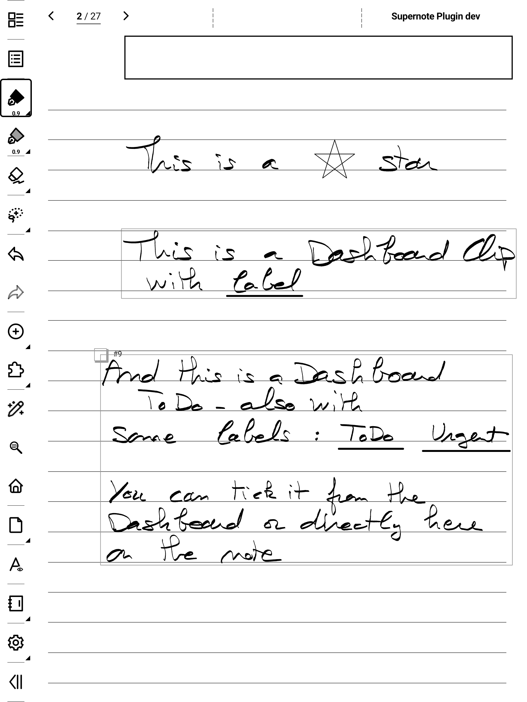 |  |

Notes only (no PDF lasso); up to **200** clips (oldest drop off).

### ☑ To-do

A to-do is a clip captured as a **task**. In a note, lasso it and tap the second lasso button,
**"Dashboard To-do"**: the area gets a frame with a small **tick-box** in its corner and a **"#N"** tag,
and the task appears in a **To-do** block with **Open / Done** tabs.

| Open (a task with labels + OCR) | Done (struck through) |
|---|---|
| 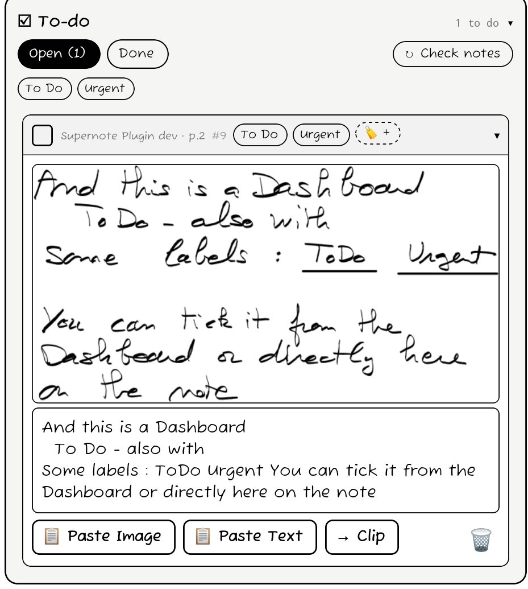 | 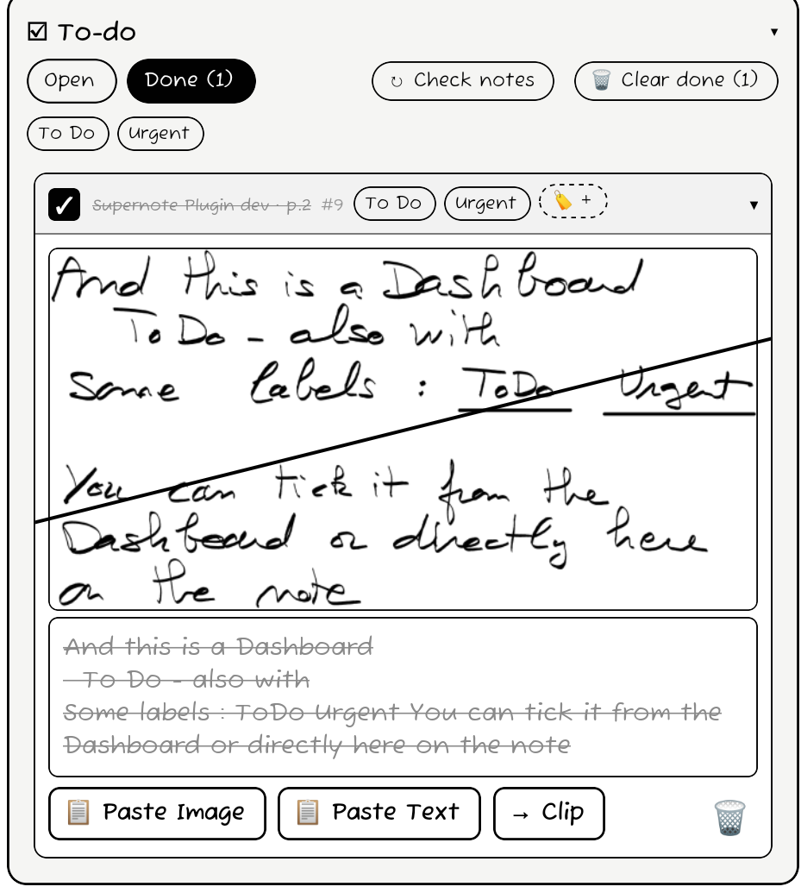 |

Checking works **both ways**:

- **In the dashboard**: tap the checkbox. The plugin draws the ✓ inside the box **on the note**; untick
  and it erases it.
- **By hand on the note**: draw a check in the box, then tap **"↻ Check notes"** on the To-do block (or
  **↻ Refresh all**). The dashboard marks it done and **replaces your hand-drawn check with its own** ✓
  (so a later dashboard untick can clear it). This runs for the **note you have open**, and it's manual
  so opening the dashboard stays fast. **Un-checking is done from the dashboard.**

| The to-do marked on the note (empty box + #9) | The same box, checked from the dashboard |
|---|---|
|  |  |

Finished tasks are **kept** (never auto-deleted) and don't count against the 200-clip cap; **🗑 Clear
done** removes them. Deleting a to-do removes only its **"#N"** tag from the note (quick, expected page
only), leaving the frame so the page still shows it was a task. If you cut a marked area to **another
page or note**, checking it offers an **on-demand search** (this note, then all notes, newest first,
with a **Stop**) to find its "#N" again.

Its **🔧** options mirror Clips (layout, size, sort, display, folder / label filters):

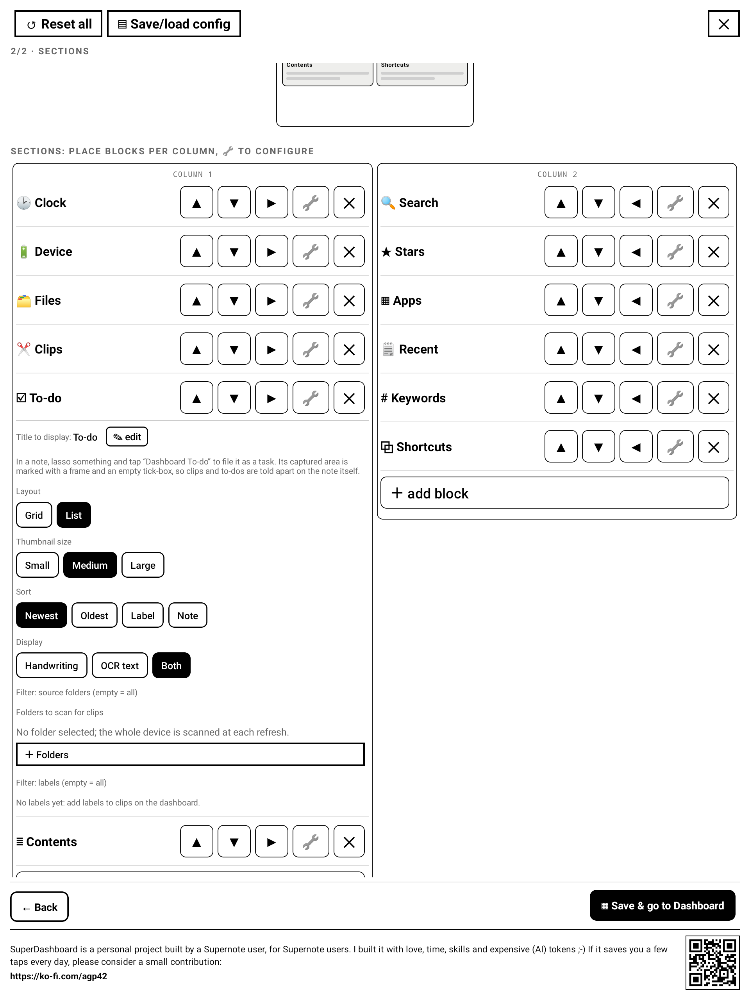

### ▭ Empty

A spacer to reserve vertical space or line up columns.

---

## 5. Save / load configurations

The header's **▤ Save/load config** saves your whole dashboard under a name and reloads it anytime;
handy before experimenting, or to recover after an accidental **↺ Reset all**. Profiles live in
`MyStyle/Plugins/Dashboard/profiles.json`.

---

## 6. Reference

### Search grammar

A small grammar (shown under the search box) refines the query:

| Type | Means |
|---|---|
| `two words` | all words must match (in any order) |
| `"exact phrase"` | a literal phrase, spaces included |
| `=name` | the whole name equals this |
| `a\|b` | either `a` or `b` |
| `!word` | exclude anything matching `word` |
| `f:folder` | only items whose path contains `folder` |
| `kw:` | only keyword results |
| `title:` | only note headings (when title search is on) |
| `star:` | only files that have a five-star |
| `type:note` `type:pdf` `type:doc` `type:folder` | keep only that kind |
| `approx:` | typo-tolerant (subsequence) match |

### Multi-select browser

**＋ Add folder / note / PDF / EPUB** (Shortcuts), the **scan folders** picker (Stars / Keywords /
Search / Clips / To-do) and the **apps** picker all use a full-page browser: navigate, tick several
items, then **Save (N)** adds them at once.

### Scanning (stars & keywords)

Stars and Keywords come from scanning your notes. Each block shows its **last scan** time and a **↻** in
its header; **↻ Refresh all** refreshes everything. The scan is **incremental**: the first scan of a
folder set is slow, later ones only re-read files you've **edited**. Blocks over the **same folders**
share one scan. A **manual ↻ Refresh** also saves the note open underneath, so a star/keyword you *just*
added on the current page shows up without turning the page. Tip: point scans at `/Note` (or a subfolder)
rather than the whole device for speed.

### Advanced

The whole configuration is a JSON file at **`MyStyle/Plugins/Dashboard/config.json`**; power users can
edit it directly (the wizard writes the same file). Scan caches, the title (Contents) cache, star
line-preview images and clip thumbnails live in the plugin's private folder, so they aren't
cloud-synced and are cleaned up automatically.

---

## 7. Good to know / limits

- **Page jump**: notes, PDFs, EPUBs and comics open **on the target page** (a star's page, a keyword's
  page, a shortcut's saved page, a clip's or heading's source page) via the firmware's file opener.
- **Recent on Chauvet 3.29.43 / 2.26.40+**: the device's recently-opened list (`/Recent`) is outside the
  plugin's file sandbox there, so Recent shows recently-**modified** notes/documents instead.
- **Stars/keywords in PDFs/EPUBs** aren't listed (the system only exposes them for notes).
- **Note Clips / To-dos** capture works in **notes only** (no PDF lasso); a clip's optional on-note
  frame is permanent.
- **To-dos**: checking is two-way, but **un-checking is done from the dashboard** (a hand-drawn check is
  detected on **↻ Check notes** / **Refresh all**, for the note you have open, and replaced with the
  plugin's own tick so it can be cleared). On a note whose page size is unusual, a check drawn from the
  dashboard onto a page you're **not** currently viewing may land imperfectly; check from the open note
  or by hand there.
- **Contents / title search** are OCR-based and cached: a heading appears once its page has been read
  (the current note when you open Contents; the library from a Search block, refreshed for notes you
  change). Handwriting OCR can occasionally misread a heading.
- **New stars/keywords** on the page you're editing show up on a **manual ↻ Refresh** (which saves the
  open note); an auto-scan alone sees them after a page-turn (when the editor saves).
- **Stray bubble**: removing the plugin clears its bubble. If one ever lingers (e.g. after a reinstall),
  open the plugin once (it clears leftovers), set **Bubble = Off**, or reboot.

---

## Support

SuperDashboard is a personal project built by a Supernote user, for Supernote users. If it saves you a
few taps every day, a small contribution is appreciated: https://ko-fi.com/agp42
