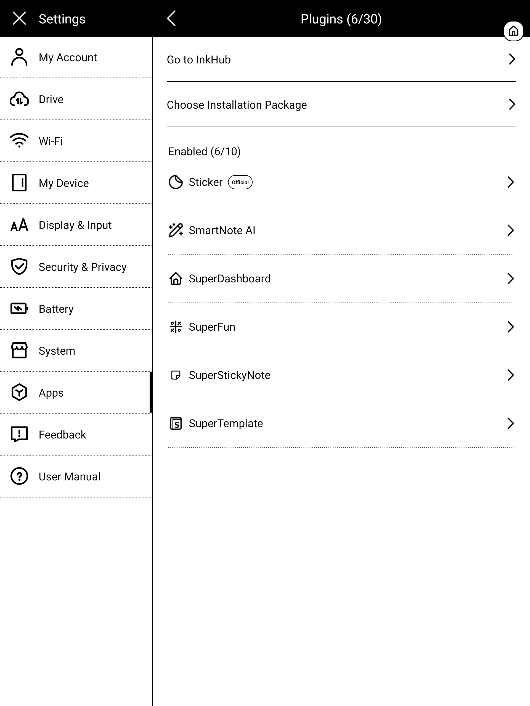

# SuperDashboard for Supernote: User Guide

SuperDashboard turns a floating **⊕ bubble** (and the plugin toolbar button) into a launcher for your
Supernote: one tap opens a dashboard you compose yourself from **shortcuts**, a **file browser**,
**name search**, **recent files**, **stars**, **keywords**, a **clock**, **device status**, **app**
launchers and **Note Clips**. It runs fully on-device and offline.

## See it in action

*Bubble to dashboard, opening shortcuts, adding a ★ and refreshing to catch it, keyword chips, the
settings wizard, and folding back to the bubble.* ▶ [Full-quality walkthrough (MP4)](docs/dashboard-demo.mp4)

> **Which version do I need?** Supernote's firmware is called **Chauvet** (the platform name, like
> "Android"), so what matters is the **version number**. This build (**v1.0.2**) is for **Chauvet
> 3.29.43** (Manta / Nomad) / **2.26.40** (A5 X / A6 X) **or later**, which added the plugin permission
> system. If your device is on an **older** Chauvet, use **v0.22.0** instead: a build made for one
> firmware version won't run on the other ("package not compatible", or it does nothing). Check your
> version in the device settings.
>
> **First-run permissions:** on 3.29.43 / 2.26.40+, SuperDashboard asks once for **file access**. It
> declares two plugin permissions (shown under Settings → Apps → Plugins → SuperDashboard → Permissions):
>
> - **FILE:READ**: to read your notes & folders: scan **stars/keywords**, build the **search** index,
>   read **Recent**, browse in the **file browser**, capture **Note Clips**, and load your **saved settings**.
> - **FILE:WRITE**: to **save your settings/profiles**, **delete a star** from a note, and (only when you
>   turn it on) draw the optional **clip frame** on a note.
>
> The Chauvet firmware enforces this even for plain file reads, so without READ the scans fail silently.
> If you decline, the launcher (shortcuts, apps, opening files/folders, clock, device status) keeps
> working; only the note-scanning zones and saving settings are affected. SuperDashboard is fully
> offline: **no INTERNET permission**, no network calls.

---

## 1. Install

1. Copy `SuperDashboard.snplg` (from the GitHub Releases, or `dist/`) into the **`MyStyle`** folder on
   your Supernote (USB, or the Partner app).
2. On the device: **Settings → Apps → Plugins**, then tap **Choose Installation Package** and pick the
   `SuperDashboard.snplg` you copied. (**Go to InkHub** is Supernote's plugin store; for a build from
   GitHub, use **Choose Installation Package**.)

| Plugins page | About this plugin |
|---|---|
|  |  |

Open any note or document and tap the **SuperDashboard** button in the side toolbar. On first run it opens
the Settings wizard (nothing is configured yet); afterwards it opens your dashboard directly. The
floating bubble also opens the dashboard from anywhere.

---

## 2. The bubble

The dashboard's **⊖** button folds it into a small floating **⊕ bubble** (opening a note or shortcut
from the dashboard also leaves it running as the bubble). It floats over everything: notes,
folders, apps, settings.

- **Tap** to open your dashboard full-screen.
- **Drag** it anywhere; it stays where you leave it. On its very first appearance it sits **top-right**.

The bubble hides itself while the dashboard is open and comes back when you leave, automatically, by
any exit (buttons, a stray edge gesture, the system backgrounding the view), so it never gets stuck
off-screen. After a device restart (or auto power-off) it re-appears when the plugin next loads.

The bubble is the **house logo** in a small rounded chip: icon only. In Settings → *Look* → Bubble
it's a simple **On / Off** choice; **Off** uses only the toolbar **SuperDashboard** button.
**Removing the plugin now clears the bubble automatically**, so you no longer have to set it Off first
before uninstalling (a reboot remains the ultimate fallback if one ever lingers).

---

## 3. The dashboard

The dashboard is **1, 2 or 3 columns** of **blocks**. Tap anything to act. Top-left is
**⚙ Configuration** (kept away from the busy right side); the title is centred; top-right are
**↻ Refresh all** and **⊖** (fold back to the bubble). Every block can be **collapsed** to just its
title (tap the ▾ / ▸ on its header); the state is remembered.

The blocks you can place:

- **Shortcuts**: open a folder (opens the file manager there), a note, a PDF, an EPUB or a comic
  (CBZ/XPS/FB2), and it opens **on the right page**. List, grid, or inline.
- **Files**: a small **file browser** to walk your folders and open any file, right from the dashboard.
- **Search**: type to find files, folders and keywords (see section 5).
- **Recent**: your recently-used notes & documents. On the stable firmware these are the device's
  recently-**opened** files (the last 8 it tracks). On Chauvet 3.29.43 / 2.26.40 and later that list is
  outside the plugin sandbox, so Recent instead shows the recently-**modified** notes/documents under
  `/Note` and `/Document`, newest first.
- **Stars**: every starred (★) page from the last scan, grouped by note (see section 6).
- **Keywords**: your notes' keywords, shown as tappable **chips**; each chip opens that exact note + page.
- **Clock**: time, date, week number and extra time zones, in several faces (see section 7).
- **Device**: battery, free storage and library stats (see section 8).
- **Apps**: buttons that launch ToDo, Calendar, Document, Files, or any installed app.
- **Note Clips**: snippets you lassoed from a note, pinned as thumbnails that link back to their page
  (see section 9).

---

## 4. Building your dashboard (Settings)

Open Settings from **⚙ Configuration** on the dashboard (or the toolbar button on first run). It's a
**2-step wizard** (Look, Sections); every change **saves automatically**. The header always shows
**↺ Reset all** and **▤ Save/load config** (see section 10), and a **✕** to close. **▦ Save & go to
Dashboard** or **Next →** move you along. A support footer sits under the nav bar on every step.

### Step 1 - Look

- **Layout - columns**: **1, 2 or 3** columns. Each column is an independent vertical stack, so
  columns can have different heights.
- **Vertical flow**: **Masonry** (each block takes its natural height) or **Fixed height** (each block
  gets a set height and scrolls inside; collapsing a block keeps its slot so the grid stays aligned).
- **Design**: nine themes, previewed on your own layout: **Ledger, Boxed, Airy, Grid (black), Grid
  (grey), Compact, Card, Minimal, Underline**.
- **Bubble**: House or Off.

- **Text size** (S / M / L / XL; bigger is easier for finger taps) and an independent **heading size**
  for the section titles.
- **Font**: **System default**, or any `.ttf` / `.otf` you drop into **`MyStyle/fonts`** (it applies
  to the dashboard text).
- **Block icons**: show or hide each block's type emoji on its title.
- **Note Clips**: the optional capture **frame**: No frame / Grey / Black (see section 9).
- **Scanning** (stars & keywords): On open / Stale > 6h / Stale > 24h / Manual (see section 11).

### Step 2 - Sections

A **live preview** of your page, then one list per column. **＋ add block** opens a menu of block
types (Shortcuts, Files, Search, Recent, Stars, Keywords, Clock, Device, Apps, Clips, plus an **Empty**
spacer to reserve space); you can have **several of the same kind**. Each block has controls:

- **▲ ▼** reorder within the column
- **◀ ▶** move it to the previous / next column
- **🔧** configure it inline (its options appear right there)
- **✕** remove it
- **✎ edit** the block's displayed title (leave it blank to hide the title)

In a 1 or 2 column layout the block name and its controls sit on one line; with 3 columns they stack.

---

## 5. Search

The Search block searches **file & folder names** plus **keywords** from your scanned notes, and groups
results into **Notes / PDFs / other docs / Folders / Keywords**. Tap a result to open it (a keyword
opens its exact page). A small **grammar** (shown under the box) refines the query:

| Type | Means |
|---|---|
| `two words` | all words must match (in any order) |
| `"exact phrase"` | a literal phrase, spaces included |
| `=name` | the whole name equals this |
| `a\|b` | either `a` or `b` |
| `!word` | exclude anything matching `word` |
| `f:folder` | only items whose path contains `folder` |
| `kw:` | only keyword results |
| `star:` | only files that have a five-star |
| `type:note` `type:pdf` `type:doc` `type:folder` | keep only that kind |
| `approx:` | typo-tolerant (subsequence) match |

In the block's **🔧**, you can scope Search to specific **folders** (leave empty to search the whole
device).

---

## 6. Stars: line preview & delete

Stars are the five-star pages from the last scan, grouped by note; each is a tappable row that opens
its page. The block's **↻ refresh** is a small icon in its header. For each starred page you can
optionally show what's written **on the star's line** (the block's **🔧** → Line preview):

- **Off**: just `p.N`.
- **Image**: the actual **handwriting** of the line (always legible).
- **Text**: **OCR** to text where the recognizer can read it, and it **falls back to the handwriting
  image** for any line it can't. Best of both.

Turn on **Allow deleting** to get a **✕★** next to each star; it removes **just that five-star** (your
handwriting is kept), after a confirmation.

> The line preview OCRs/renders per star, so it makes the scan slower; it only runs for notes that
> changed since the last scan.

---

## 7. Clock

A Clock block shows the time, and (optionally) the date and week number. In its **🔧**:

- **Style**: **Large, Compact, Weekday, Jumbo, Digital** (a 7-segment display face) or **Stamp**.
- **Time format**: 12-hour or 24-hour.
- **Date**: show or hide.
- **Week number**: Off, **ISO** (Monday-start, the European standard) or **US** (Sunday-start), shown
  as `W##`.
- **Extra time zones**: add a zone with a **label** (for example "New York") and a **+/- hour offset**
  from your device's local time. Use the **-** and **+** buttons; the **½** button adds 30 minutes for
  half-hour zones. Each extra zone shows its own time, with a small **+1 / -1** if it lands on a
  different day.
- **Region format**: how the date is written (day/month order and month names).

---

## 8. Device status

A Device block shows, each independently toggleable in its **🔧**:

- **Battery**: charge percentage and whether it's charging.
- **Storage**: free space on internal storage and on the SD card.
- **Stats**: a quick tally of your library (notes, PDFs, stars, keywords).

---

## 9. Note Clips

Note Clips let you pin a snippet of a note onto the dashboard.

1. In a **note**, lasso a region as usual.
2. In the lasso toolbar, tap **"Add to Dashboard"**. It's captured **silently** (no plugin view
   opens), so it never interrupts your writing.
3. The snippet appears as a thumbnail in a **Clips** block. **Tap it to jump back to its exact source
   note and page.**

Managing clips (on the dashboard and in the Clips block's **🔧**):

- **Labels**: tap **🏷** on a clip to add or remove labels; it reuses labels you already created, so
  they stay consistent.
- **Filter** a Clips block by **source folder** and/or **label**, so you can have several Clips blocks,
  each showing a different set.
- **Sort**: Newest, Oldest, by Label, or by Note.
- **Thumbnail size**: Small, Medium or Large. A clip is never shown larger than the original snippet.
- **Frame** (chosen in Step 1 - Look): optionally draw a **grey** or **black** rectangle on the note
  around what you captured, so you can see on the note what was clipped. That mark is a permanent part
  of the note (deleting the clip does not erase it).
- **Delete**: the **✕** on a clip removes it from the dashboard (after a confirmation). It's pushed to
  the far right of the row so you won't hit it by accident.

Good to know: up to **200** clips are kept (the oldest drop off after that), and capture works on
**notes only** (the lasso toolbar isn't available in PDFs).

---

## 10. Save / load configurations

The header's **▤ Save/load config** saves your whole dashboard under a name and reloads it anytime;
handy before experimenting, or to recover after an accidental **↺ Reset all**. Profiles live in
`MyStyle/Plugins/Dashboard/profiles.json`.

---

## 11. Scanning (stars & keywords)

Stars and Keywords come from scanning your notes. Each block shows its **last scan** time and a **↻**
in its header; **↻ Refresh all** (dashboard header) refreshes every block. The scan is **incremental**:
the first scan of a folder set is slow, but afterwards only files you've **edited** are re-scanned, so
later scans are near-instant. Blocks that scan the **same folders** share one scan. Set how often it
runs automatically in Step 1 - Look (On open / Stale > 6h / Stale > 24h / Manual). Tip: point
Stars/Keywords at `/Note` (or a subfolder) rather than the whole device for speed.

A **manual ↻ Refresh** also saves the note you have open underneath, so a star or keyword you *just*
added on the current page shows up straight away; no need to turn the page first.

---

## 12. Adding shortcuts (multi-select browser)

**＋ Add folder / note / PDF / EPUB** opens a **full-page browser**: navigate anywhere, tap
notes/PDFs/EPUBs to select several at once, **＋** a folder to add it, then **Save (N)** adds them
all in one go. The same browser (folders only) picks the **scan folders** of Stars/Keywords/Search
blocks, and the **apps picker** works the same way: tick several apps, then **Save (N)**.

---

## 13. Advanced

The whole configuration is a JSON file at **`MyStyle/Plugins/Dashboard/config.json`**; power users
can edit it directly. The wizard writes the same file. (Scan caches, star line-preview images and clip
thumbnails live in the plugin's private folder instead, so they aren't synced to the cloud and are
cleaned up automatically.)

---

## 14. Good to know / limits

- **Page jump**: notes, PDFs, EPUBs and comics open **on the target page** (a star's page, a keyword's
  page, a shortcut's saved page, or a clip's source page) via the firmware's file opener.
- **Recent on Chauvet 3.29.43 / 2.26.40+**: the device's recently-opened list (`/Recent`) is outside
  the plugin's file sandbox there, so Recent shows recently-**modified** notes/documents instead.
- **Stars/keywords in PDFs/EPUBs** aren't listed (the system only exposes them for notes).
- **Note Clips** capture works in **notes only** (no PDF lasso), and a clip's optional on-note frame is
  permanent.
- **New stars/keywords** on the page you're editing show up when you tap **↻ Refresh** (it saves the
  open note first). Without a manual refresh they appear after you **turn the page** (the editor saves
  on page-turn/close).
- **Stray bubble**: removing the plugin clears its bubble automatically. If one ever lingers (for
  example after a reinstall), open the plugin once; it clears leftover bubbles; set **Bubble = Off** in
  Settings → Look, or reboot.

---

## Support

SuperDashboard is a personal project built by a Supernote user, for Supernote users. If it saves you a
few taps every day, a small contribution is appreciated: https://ko-fi.com/agp42
