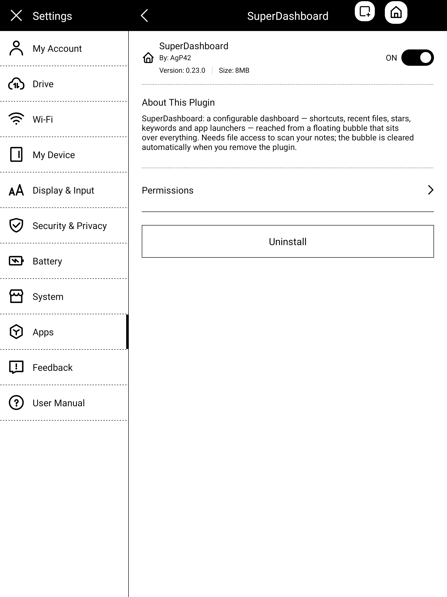
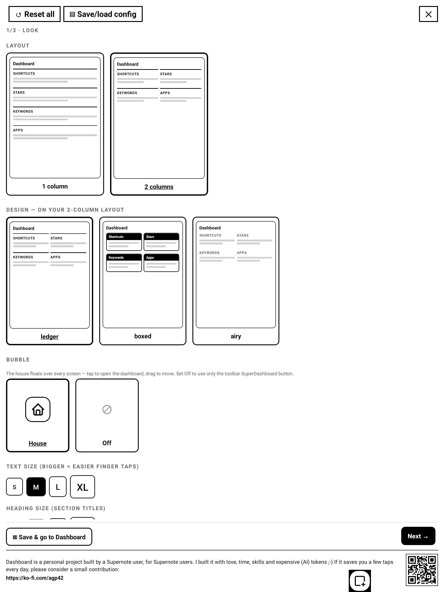

# SuperDashboard for Supernote — User Guide

SuperDashboard turns a floating **⊕ bubble** into a launcher for your Supernote: one tap opens a
dashboard you compose yourself from **shortcuts**, **recent files**, **stars**, **keywords** and
**app** sections. It runs fully on‑device and offline.

## See it in action

*Bubble → dashboard, opening shortcuts, adding a ★ and refreshing to catch it, keyword chips, the
settings wizard, and folding back to the bubble.* ▶ [Full-quality walkthrough (MP4)](docs/dashboard-demo.mp4)

> Requires the Supernote **plugin‑preview (Chauvet) firmware** with the plugin system. Works on A5X,
> A5X2 (Manta) and Nomad. A preview build doesn't run on the older stable firmware (and vice‑versa),
> so pick the release that matches your device.
>
> **First‑run permission:** SuperDashboard asks for **file access** the first time you open it — it
> needs it to scan your notes for stars/keywords and to delete a star. If you decline, the launcher
> (shortcuts, apps, opening files/folders) keeps working; only the note‑scanning zones stay empty.

---

## 1. Install

1. Copy `SuperDashboard.snplg` (from `dist/` or the Releases) into the **`MyStyle`** folder on your
   Supernote (USB, or the Partner app).
2. On the device: **Settings → Apps → Plugins → Add Plugin → SuperDashboard**.

| Plugins list | Plugin details |
|---|---|
|  |  |

Open any note or document and tap the **SuperDashboard** button in the side toolbar. On first run it opens
the Settings wizard (nothing is configured yet); afterwards it opens your dashboard directly. The
floating bubble also opens the dashboard from anywhere.

---

## 2. The bubble

The dashboard's **⊖** button folds it into a small floating **⊕ bubble** (opening a note or shortcut
from the dashboard also leaves it running as the bubble). It floats over everything — notes,
folders, apps, settings.

- **Tap** → your dashboard opens full‑screen.
- **Drag** it anywhere; it stays where you leave it. On its very first appearance it sits **top‑right**.

The bubble hides itself while the dashboard is open and comes back when you leave — automatically, by
any exit (buttons, a stray edge gesture, the system backgrounding the view), so it never gets stuck
off‑screen. After a device restart (or auto power‑off) it re‑appears when the plugin next loads.

The bubble is the **house logo** in a small rounded chip — icon only. In Settings → *Look* → Bubble
it's a simple **On / Off** choice; **Off** uses only the toolbar **SuperDashboard** button.
**Removing the plugin now clears the bubble automatically**, so you no longer have to set it Off first
before uninstalling (a reboot remains the ultimate fallback if one ever lingers).

---

## 3. The dashboard

The dashboard is a stack (or 2‑column masonry) of **sections**. Tap anything to act. Top‑left is
**⚙ Configuration** to open Settings (kept away from the busy right side); top‑right are
**↻ Refresh all** and **⊖** (fold back to the bubble).

- **Shortcuts** — a folder (opens the file manager there), a note, a PDF, an EPUB or a comic
  (CBZ/XPS/FB2) — and it opens **on the right page**. Lay them out as a list, a grid, or inline.
- **Recent** — your recently‑used notes & documents. On the stable firmware these are the device's
  recently‑**opened** files (the last 8 it tracks). On the plugin‑preview firmware that list is outside
  the plugin sandbox, so Recent instead shows the recently‑**modified** notes/documents under `/Note`
  and `/Document`, newest first.
- **Stars** — every starred (★) page from the last scan, grouped by note. Each star is a tappable
  row; a **✕★** can delete just that star (see §5).
- **Keywords** — your notes' keywords, shown as tappable **chips**; each chip opens that exact
  note + page.
- **Apps** — buttons that launch ToDo, Calendar, Document, Search, Files… (or any installed app via
  *Show all apps*).

---

## 4. Building your dashboard (Settings)

Open Settings from **⚙ Configuration** on the dashboard (or the toolbar button on first run). It's a
**3‑step wizard**; every change **saves automatically**. The header always shows **↺ Reset all** and
**▤ Save/load config** (see §6), and a **✕** to close. **▦ Save & go to Dashboard** (bottom‑left) or
**Next →** move you along. A support footer sits under the nav bar on every step.

### Step 1 · Look

Pick the **layout** (1 or 2 columns), the **design** (Ledger / Boxed / Airy, previewed on your
layout), the **bubble** style, the **text size** (bigger = easier finger taps), and the **heading
size** (the section titles, independent from the text).

### Step 2 · Sections

A **live preview** of your page and the list of sections. **＋** add a section (Shortcuts / Stars /
Keywords / Apps / Recent — you can have several of the same kind), **▲▼** reorder, **✕** remove.

### Step 3 · Content

Configure each section: the **refresh** policy, rename any section (**✎ edit**), pick **shortcut**
targets (**＋ Add folder / note / PDF / EPUB** — a full‑page multi‑select browser, see §7), choose
**scan folders** for Stars/Keywords (**＋ Folders** — the same browser, several at once) and their
**note order**, the keyword grouping, the Stars **line preview** (see §5), and the **apps** to show
(**＋ Apps** — tick several, then **Save (N)** adds them all).

---

## 5. Stars: line preview & delete

For each starred page you can optionally show what's written **on the star's line** — set **Line
preview** on a Stars section to:

- **Off** — just `p.N`.
- **Image** — the actual **handwriting** of the line (always legible).
- **Text** — **OCR** to text where the recognizer can read it, and it **falls back to the handwriting
  image** for any line it can't. Best of both.

| Image | Text (OCR) | Text with image fallback |
|---|---|---|
|  |  |  |

Turn on **Allow deleting** to get a **✕★** next to each star — it removes **just that five‑star**
(your handwriting is kept), after a confirmation.

> The line preview OCRs/renders per star, so it makes the scan slower — it only runs for notes that
> changed since the last scan.

---

## 6. Save / load configurations

The header's **▤ Save/load config** saves your whole dashboard under a name and reloads it anytime —
handy before experimenting, or to recover after an accidental **↺ Reset all**. Profiles live in
`MyStyle/Plugins/Dashboard/profiles.json`.

---

## 7. Adding shortcuts (multi‑select browser)

**＋ Add folder / note / PDF / EPUB** opens a **full‑page browser**: navigate anywhere, tap
notes/PDFs/EPUBs to select several at once, **＋** a folder to add it, then **Save (N)** adds them
all in one go. The same browser (folders only) picks the **scan folders** of Stars/Keywords
sections, and the **apps picker** works the same way: tick several apps, then **Save (N)**.

---

## 8. Scanning

Stars and Keywords come from scanning your notes. Each section shows its **last scan** time and a
**↻ Refresh** button; **↻ Refresh all** (dashboard header) refreshes every section. The scan is
**incremental** — the first scan of a folder set is slow, but afterwards only files you've **edited**
are re‑scanned, so later scans are near‑instant. Sections that scan the **same folders** share one
scan. Tip: point Stars/Keywords at `/Note` (or a subfolder) rather than the whole device for speed.

A **manual ↻ Refresh** also saves the note you have open underneath, so a star or keyword you *just*
added on the current page shows up straight away — no need to turn the page first.

---

## 9. Advanced

The whole configuration is a JSON file at **`MyStyle/Plugins/Dashboard/config.json`** — power users
can edit it directly. The wizard writes the same file. (Scan caches and star‑line images live in the
plugin's private folder instead, so they aren't synced to the cloud and are cleaned up automatically.)

---

## 10. Good to know / limits

- **Page jump**: notes, PDFs, EPUBs and comics now open **on the target page** (a star's page, a
  keyword's page, or a shortcut's saved page) via the firmware's file opener.
- **Recent on the preview firmware**: the device's recently‑opened list (`/Recent`) is outside the
  plugin's file sandbox there, so Recent shows recently‑**modified** notes/documents instead.
- **Stars/keywords in PDFs/EPUBs** aren't listed (the system only exposes them for notes).
- **New stars/keywords** on the page you're editing show up when you tap **↻ Refresh** (it saves the
  open note first). Without a manual refresh they appear after you **turn the page** (the editor saves
  on page‑turn/close).
- **Search** launches the native search but can't be pre‑filled.
- **Stray bubble**: removing the plugin clears its bubble automatically. If one ever lingers (e.g.
  after a reinstall), open the plugin once — it clears leftover bubbles — set **Bubble = Off** in
  Settings → Look, or reboot.
